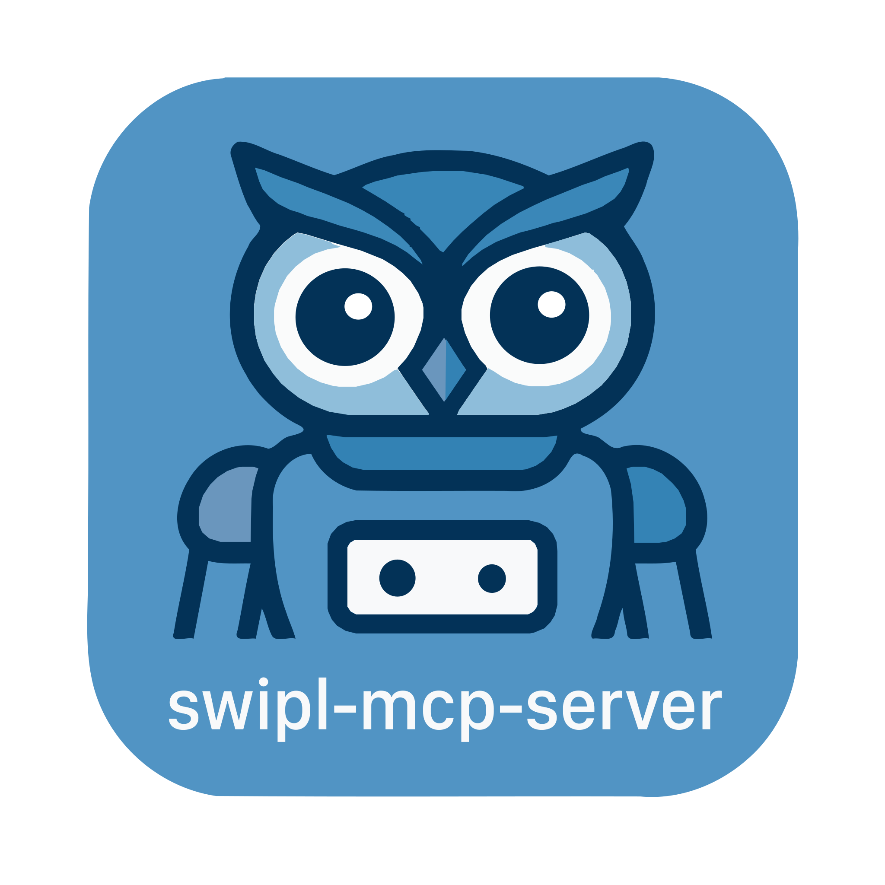

<h1>SWI-Prolog MCP Server</h1>

| Package | License | Node |
|---------|---------|------|
| [@vpursuit/swipl-mcp-server](https://www.npmjs.com/package/@vpursuit/swipl-mcp-server) | BSD-3-Clause | ≥20.0.0 |

An MCP server that lets tools-enabled LLMs work directly with SWI‑Prolog. It supports loading Prolog files, adding/removing facts and rules, listing symbols, and running queries with deterministic pagination and true engine backtracking.

## Installation

### Claude Code CLI
```bash
claude mcp add swipl-mcp-server npx @vpursuit/swipl-mcp-server
```

### Claude Desktop
```json
{
  "mcpServers": {
    "swipl": {
      "command": "npx",
      "args": ["@vpursuit/swipl-mcp-server"]
    }
  }
}
```

- MacOS: `~/Library/Application Support/Claude/claude_desktop_config.json`
- Windows: `%APPDATA%/Claude/claude_desktop_config.json`

### Cline (VS Code Extension)
```json
{
  "mcpServers": {
    "swipl-mcp-server": {
      "autoApprove": [],
      "disabled": false,
      "timeout": 60,
      "type": "stdio",
      "command": "npx",
      "args": ["@vpursuit/swipl-mcp-server"]
    }
  }
}
```
Configure via Cline's MCP settings in VS Code.

### Codex
```toml
[mcp_servers.swipl-mcp-server]
transport = "stdio"
enabled = true
command = "npx"
args = ["@vpursuit/swipl-mcp-server"]
```
Add to `~/.codex/config.toml`

### ... and many others may also work

## Requirements

- Node.js ≥ 20.0.0
- SWI‑Prolog installed and available in PATH

## Configuration

### Environment Variables

Configure timeouts and logging via environment variables:

| Variable | Description | Default |
|----------|-------------|---------|
| `SWI_MCP_READY_TIMEOUT_MS` | Server startup timeout (ms) | `5000` |
| `SWI_MCP_QUERY_TIMEOUT_MS` | Query execution timeout (ms) | `30000` |
| `MCP_LOG_LEVEL` | Logging verbosity | `warn` |
| `DEBUG` | Enable debug logging (`swipl-mcp-server`) | - |
| `SWI_MCP_TRACE` | Low-level spawn/protocol trace | - |
| `SWI_MCP_PROLOG_PATH` | Override Prolog server script path | - |

## Features

### MCP Prompts
Prompts guide AI assistants to help you with Prolog programming, knowledge base building and query optimization.

**How it works:**
1. You select a prompt (via `/swipl` command in Claude Code CLI)
2. The prompt guides the AI assistant on how to approach your Prolog task
3. The AI assistant helps you with expert knowledge and step-by-step guidance

*Note: Other AI assistants may access and use these prompts differently depending on their MCP implementation.*

In Claude Code CLI, these prompts are available as slash commands. Simply type `/swipl` to see all available commands.

- **`prolog_init_expert`** - Initialize expert Prolog assistance mode
- **`prolog_quick_reference`** - Get comprehensive server overview
- **`prolog_analyze_knowledge_base`** - Analyze current knowledge base state
- **`prolog_knowledge_base_builder`** - Build domain-specific knowledge bases
- **`prolog_query_optimizer`** - Optimize Prolog queries for performance

### MCP Resources
Access to knowledge base and server information:

- **`prolog://knowledge_base/predicates`** - List all predicates in the knowledge base
- **`prolog://knowledge_base/dump`** - Export complete knowledge base
- **`reference://help`** - Usage guidelines and tips
- **`reference://license`** - License information
- **`reference://capabilities`** - Server capabilities (JSON)

### Tools Overview

- **Core:** `help`, `license`, `capabilities`
- **Knowledge base:** `knowledge_base_load`, `knowledge_base_assert`, `knowledge_base_retract`, `knowledge_base_dump`
- **Query:** `query_start`, `query_startEngine`, `query_next`, `query_close`
- **Symbols:** `symbols_list`

## What's Available

### ✅ Standard Prolog Predicates (Available)

The server includes a rich set of standard Prolog predicates for constraint solving and logic programming:

| Category | Available Predicates |
|----------|---------------------|
| **List Operations** | `member/2`, `append/3`, `length/2`, `reverse/2`, `permutation/2`, `select/3`, `nth0/3`, `nth1/3`, `last/2`, `flatten/2`, `delete/3` |
| **Set Operations** | `union/3`, `intersection/3`, `subtract/3`, `list_to_set/2`, `is_set/1`, `subset/2` |
| **Numeric** | `between/3`, `sum_list/2`, `max_list/2`, `min_list/2`, `numlist/3` |
| **Arithmetic** | `is/2`, `=\=/2`, `</2`, `>/2`, `=</2`, `>=/2`, `abs/1`, `+`, `-`, `*`, `/`, `mod`, `//` |
| **Meta** | `findall/3`, `bagof/3`, `setof/3`, `forall/2`, `call/1`, `maplist/2-5` |
| **Logic** | `\+/1` (negation), `->` (if-then), `;` (or), `,` (and) |

**Key Points:**
- These predicates work out-of-the-box - no need to assert or load them
- Use standard Prolog syntax: `member(X, [1,2,3])`, `between(1, 10, X)`, `X is Y + 1`
- Perfect for constraint problems using generate-and-test pattern

### ❌ CLP(FD) Not Available

For security reasons, `library(clpfd)` (Constraint Logic Programming over Finite Domains) is **not available**. This means:

| CLP(FD) Syntax | Standard Prolog Alternative |
|----------------|---------------------------|
| `X in 1..10` | `between(1, 10, X)` |
| `X #= Y + 1` | `X is Y + 1` |
| `X #\= Y` | `X =\= Y` |
| `X #< Y` | `X < Y` (requires instantiated values) |
| `all_different/1` | Use `permutation/2` or custom predicate |
| `label/1` | Use `member/2` or `permutation/2` |

**But you CAN still solve constraint problems!** Use generate-and-test pattern:
```prolog
% Generate candidates, then test constraints
solution(X, Y, Z) :-
    member(X, [1,2,3,4]),
    member(Y, [1,2,3,4]),
    member(Z, [1,2,3,4]),
    X =\= Y, X =\= Z, Y =\= Z,  % All different
    X < Y + Z.                   % Custom constraint
```

### 📚 Key Points

- All standard SWI-Prolog predicates work out-of-the-box
- Use standard Prolog syntax: `member(X, [1,2,3])`, `between(1, 10, X)`, `X is Y + 1`
- CLP(FD) library(clpfd) is not available for security reasons
- Use alternatives: `between/3` for domains, `is/2` for arithmetic, `permutation/2` for uniqueness

## Protocol (short)

- Each request/response is a single-line Prolog term.
- Requests are enveloped as `cmd(ID, Term)` and responses as `id(ID, Reply)`; bare terms remain accepted.

## Usage Examples

### How the AI Assistant Helps You

When you ask questions about Prolog, the AI assistant uses these tools behind the scenes:

**You ask:** "Load my family relationships file"
**AI uses:**
```json
knowledge_base_load { "filename": "~/.swipl-mcp-server/family.pl" }
```
**You see:** "I've loaded your family relationships file."

**You ask:** "Who are Mary's parents?"
**AI uses:**
```json
query_start { "query": "parent(X, mary)" }
```
then `query_next()`
**You see:** "Mary's parent is John."

**You ask:** "Add the fact that John is the parent of Mary"
**AI uses:**
```json
knowledge_base_assert { "fact": "parent(john, mary)" }
```
**You see:** "I've added that John is Mary's parent."

**You ask:** "Show me all fruits in the list [apple, banana, cherry]"
**AI uses:**
```json
query_startEngine { "query": "member(X, [apple, banana, cherry])" }
```
with multiple `query_next()`
**You see:** "The fruits in your list are: apple, banana, and cherry."

**You ask:** "What predicates do I have defined?"
**AI uses:** `symbols_list()`
**You see:** "You have these predicates: parent/2, male/1, female/1..."

### Behind the Scenes

The AI assistant manages:
- Loading and saving your Prolog knowledge bases
- Running queries and collecting all solutions
- Adding and removing facts as you request
- Optimizing your Prolog code
- Ensuring security (files only from ~/.swipl-mcp-server/)

## Safety & Security

- **File Path Restrictions**: Only `~/.swipl-mcp-server/` directory allowed for file operations
- **Dangerous Predicate Blocking**: Pre-execution detection of `shell()`, `system()`, `call()`, etc.
- **Hybrid Validation**: library(sandbox) validation plus explicit security checks
- **Session Management**: Mutual exclusion between modes; timeouts for protection

## Troubleshooting

- SWI‑Prolog not found: `swipl --version` must work
- Increase `SWI_MCP_READY_TIMEOUT_MS`/`SWI_MCP_QUERY_TIMEOUT_MS` if timing out
- Use `SWI_MCP_PROLOG_PATH` to point at a custom `server.pl`

## Package Info

- Dependencies: `@modelcontextprotocol/sdk`, `zod`
- License: BSD‑3‑Clause
- Repository: https://github.com/vpursuit/swipl-mcp-server

## Support

File issues and feature requests on GitHub.

---

Built with [SWI‑Prolog](https://www.swi-prolog.org/) and the [Model Context Protocol](https://modelcontextprotocol.io/).
