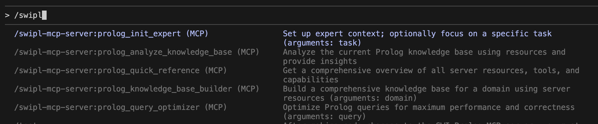

# SWI-Prolog MCP Server

| Package | License | Node | Repository |
|---------|---------|------|------------|
| [@vpursuit/swipl-mcp-server](https://www.npmjs.com/package/@vpursuit/swipl-mcp-server) | BSD-3-Clause | ≥20.0.0 | [GitHub](https://github.com/vpursuit/swipl-mcp-server) |

An MCP server that lets tools-enabled LLMs work directly with SWI‑Prolog. It supports loading Prolog files, adding/removing facts and rules, listing symbols, and running queries with two modes: deterministic pagination and true engine backtracking.

## Table of Contents

- [Requirements](#requirements)
- [Installation](#installation)
  - [Claude Code CLI](#claude-code-cli)
  - [Claude Desktop](#claude-desktop)
  - [Cline (VS Code Extension)](#cline-vs-code-extension)
  - [Codex](#codex)
  - [MCP Inspector (for testing)](#mcp-inspector-for-testing)
  - [Development Setup](#development-setup)
- [Configuration](#configuration)
  - [Environment Variables](#environment-variables)
  - [State & Lifecycle](#state--lifecycle)
- [Features](#features)
  - [MCP Prompts](#mcp-prompts)
  - [MCP Resources](#mcp-resources)
  - [Tools](#tools)
- [Examples](#examples)
- [Architecture](#architecture)
- [Security](#security)
- [Troubleshooting](#troubleshooting)
- [Development](#development)
- [Contributing](#contributing)
- [Documentation](#documentation)
- [License](#license)


## Requirements

- Node.js ≥ 20.0.0
- SWI‑Prolog installed and available in PATH

## Installation

### Claude Code CLI
```bash
claude mcp add swipl-mcp-server npx @vpursuit/swipl-mcp-server
```

### Claude Desktop
```json
{
  "mcpServers": {
    "swipl": {
      "command": "npx",
      "args": ["@vpursuit/swipl-mcp-server"]
    }
  }
}
```

- MacOS: `~/Library/Application Support/Claude/claude_desktop_config.json`
- Windows: `%APPDATA%/Claude/claude_desktop_config.json`

### Cline (VS Code Extension)
```json
{
  "mcpServers": {
    "swipl-mcp-server": {
      "autoApprove": [],
      "disabled": false,
      "timeout": 60,
      "type": "stdio",
      "command": "npx",
      "args": ["@vpursuit/swipl-mcp-server"]
    }
  }
}
```
Configure via Cline's MCP settings in VS Code.

### Codex
```toml
[mcp_servers.swipl-mcp-server]
transport = "stdio"
enabled = true
command = "npx"
args = ["@vpursuit/swipl-mcp-server"]
```
Add to `~/.codex/config.toml`

### MCP Inspector (for testing)
```bash
npx @modelcontextprotocol/inspector --transport stdio npx @vpursuit/swipl-mcp-server
```

### ... and many others may also work

### Development Setup
If you cloned the repo, you may use this configuration. Note: change <path to your development directory> to your local setup. 
```json
{
  "mcpServers": {
    "swipl": {
      "command": "node",
      "args": ["<path to your development directory>/swipl-mcp-server/build/index.js"],
      "env": {
        "SWI_MCP_READY_TIMEOUT_MS": "10000",
        "SWI_MCP_QUERY_TIMEOUT_MS": "120000",
        "MCP_LOG_LEVEL": "debug",
        "DEBUG": "swipl-mcp-server"
      }
    }
  }
}
```

## Configuration

### Environment Variables

Configure timeouts, logging, and behavior via environment variables:

- `SWI_MCP_READY_TIMEOUT_MS`: server startup timeout (ms), default 5000
- `SWI_MCP_QUERY_TIMEOUT_MS`: query execution timeout (ms), default 30000
- `MCP_LOG_LEVEL`: `debug` | `info` | `warn` | `error` | `silent` (default `warn`)
- `DEBUG`: enable debug logs, set to `swipl-mcp-server`
- `SWI_MCP_TRACE`: optional low-level trace of child I/O and protocol
- `SWI_MCP_PROLOG_PATH`: override Prolog server script path

## State & Lifecycle

- Transport: `stdio`. The MCP client owns the connection lifecycle.
- Shutdown: the server exits on `SIGINT`/`SIGTERM` or when the client closes stdio. On stdio close, a small grace (~25ms) allows final responses to flush before exit.
- Stateful per connection: asserted facts/rules live in memory for the lifetime of the MCP connection (one Node process and one SWI‑Prolog child). When the client disconnects and the server exits, in‑memory state is reset on next start.
- Client guidance: keep a single stdio connection open for workflows that depend on shared state across multiple tool calls; avoid closing stdin immediately after a request.
- Durability (optional): if persistent Knowledge Base is desired across restarts, use `knowledge_base_dump` to save to `~/.swipl-mcp-server/` and `knowledge_base_load` (or `knowledge_base_assert_many`) to restore on startup. See docs/lifecycle.md for patterns.

## Features

### MCP Prompts
Prompts guide AI assistants to help you with Prolog programming, knowledge base building and query optimization.

**How it works:**
1. You select a prompt (via `/swipl` command in Claude Code CLI)
2. The prompt guides the AI assistant on how to approach your Prolog task
3. The AI assistant helps you with expert knowledge and step-by-step guidance

*Note: Other AI assistants may access and use these prompts differently depending on their MCP implementation.*

In Claude Code CLI, these prompts are available as slash commands. Simply type `/swipl` to see all available commands:



Available prompts:
- **`prolog_init_expert`** - Initialize expert Prolog assistance mode with optional task focus
- **`prolog_quick_reference`** - Get comprehensive server overview and capabilities
- **`prolog_analyze_knowledge_base`** - Analyze current knowledge base state and structure
- **`prolog_knowledge_base_builder`** - Build domain-specific knowledge bases with guided construction
- **`prolog_query_optimizer`** - Optimize Prolog queries for performance and efficiency

### MCP Resources
Dynamic and static resources for knowledge base access:

- **`prolog://knowledge_base/predicates`** - List all predicates in the knowledge base
- **`prolog://knowledge_base/dump`** - Export complete knowledge base as Prolog clauses
- **`reference://help`** - Usage guidelines and server tips
- **`reference://license`** - BSD-3-Clause license text
- **`reference://capabilities`** - Machine-readable server capabilities (JSON)

### Tools

- **Core:** `help`, `license`, `capabilities`
- **Knowledge base:** `knowledge_base_load`, `knowledge_base_assert`, `knowledge_base_assert_many`, `knowledge_base_retract`, `knowledge_base_retract_many`, `knowledge_base_clear`, `knowledge_base_dump`
- **Query:** `query_start`, `query_startEngine`, `query_next`, `query_close`
- **Symbols:** `symbols_list`

## Examples

- Load and query (files must be in `~/.swipl-mcp-server/`):
  - `knowledge_base_load { filename: "~/.swipl-mcp-server/family.pl" }`
  - `query_start { query: "parent(X, mary)" }` → `query_next()` until no more solutions → `query_close()`
- Engine mode:
  - `query_startEngine { query: "member(X, [1,2,3])" }` → `query_next()` repeatedly → `query_close()`
- Database operations:
  - Single: `knowledge_base_assert { fact: "parent(john, mary)" }`
  - Multiple: `knowledge_base_assert_many { facts: ["parent(john, mary)", "parent(mary, alice)"] }`
  - Remove single: `knowledge_base_retract { fact: "parent(john, mary)" }`
  - Remove multiple: `knowledge_base_retract_many { facts: ["parent(john, mary)", "parent(mary, alice)"] }`
  - Clear all: `knowledge_base_clear {}`

See docs/examples.md for many more, including arithmetic, list ops, collections, and string/atom helpers.

## Architecture

- Single persistent SWI‑Prolog process with two query modes (standard via `call_nth/2`, engine via SWI engines)
- Term-based wire protocol: Node wraps requests as `cmd(ID, Term)`, replies as `id(ID, Reply)`; back‑compatible with bare terms
- Enhanced security model with file path restrictions, library(sandbox) validation, and dangerous predicate blocking

Details: see docs/architecture.md.

### Session State Machine

The server maintains a session state machine to coordinate query and engine sessions. Key points:

- Exactly one session type can be active at a time (query or engine)
- The `*_completed` states keep context so that subsequent `next` calls respond with "no more solutions" until explicitly closed
- Transient `closing_*` states serialize shutdown before new sessions begin
- Invalid transitions are logged when `SWI_MCP_TRACE=1`

For the detailed state transition diagram, see [docs/session-state.md](docs/session-state.md).

## Security

The server implements multiple security layers to protect your system:

### File Path Restrictions
- **Allowed Directory**: Files can only be loaded from `~/.swipl-mcp-server/`
- **Blocked Directories**: System directories (`/etc`, `/usr`, `/bin`, `/var`, etc.) are automatically blocked
- **Example**: `knowledge_base_load { filename: "/etc/passwd" }` → `Security Error: Access to system directories is blocked`

### Dangerous Predicate Detection
- **Pre-execution Blocking**: Dangerous operations are caught before execution
- **Blocked Predicates**: `shell()`, `system()`, `call()`, `assert()`, `halt()`, etc.
- **Example**: `knowledge_base_assert { fact: "malware :- shell('rm -rf /')" }` → `Security Error: Operation blocked - contains dangerous predicate 'shell'`

### Additional Protections
- Library(sandbox) validation for built-in predicates
- Timeout protection against infinite loops
- Module isolation in dedicated `knowledge_base` namespace

See [SECURITY.md](SECURITY.md) for complete security documentation.

## Troubleshooting

- "Prolog not found": ensure `swipl --version` works; SWI‑Prolog must be in PATH
- Startup timeout: increase `SWI_MCP_READY_TIMEOUT_MS`
- Query timeout: increase `SWI_MCP_QUERY_TIMEOUT_MS`
- Session conflicts: close current session before starting a different mode
- `Security Error: ...`: file access blocked or dangerous predicates detected; see Security
- Custom script path: set `SWI_MCP_PROLOG_PATH`
- Query sessions: after exhausting solutions, `query_next` returns "No more solutions available" until explicitly closed

## Development

- Install deps: `npm install`
- Build: `npm run build`
- Run dev server: `npm run server`
- Tests: `npm test` (see CONTRIBUTING.md for details)

Publishing and release workflows are documented in docs/deployment.md.

## Contributing

See CONTRIBUTING.md for local setup, workflow, and the PR checklist.

For security practices, reporting, and hardening guidance, see SECURITY.md.

## Documentation

- **[Installation Guide](docs/installation.md)** — Complete setup for all MCP clients
- **[Features Reference](docs/features.md)** — Detailed prompts, resources, and tools documentation
- **[Examples](docs/examples.md)** — Copy-paste usage examples
- **[Architecture](docs/architecture.md)** — Components, modes, and wire protocol
- **[Lifecycle](docs/lifecycle.md)** — Server lifecycle, state, and persistence patterns
- **[Deployment](docs/deployment.md)** — Release, packaging, and install from source

## License

BSD‑3‑Clause. See LICENSE for details.
