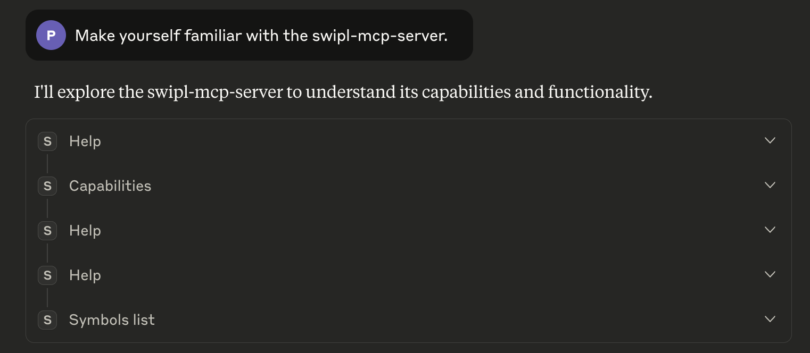
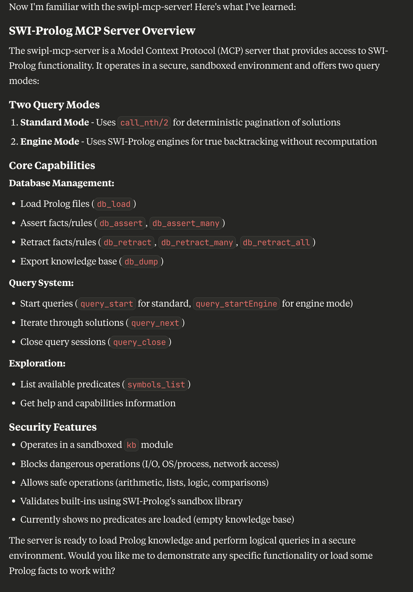
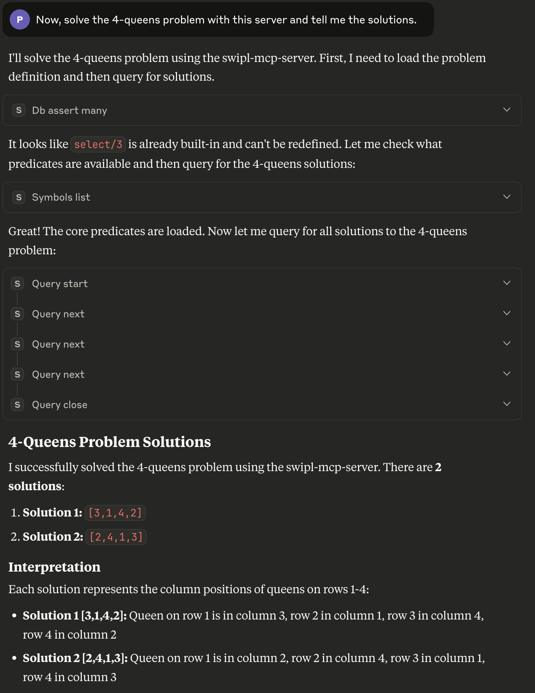
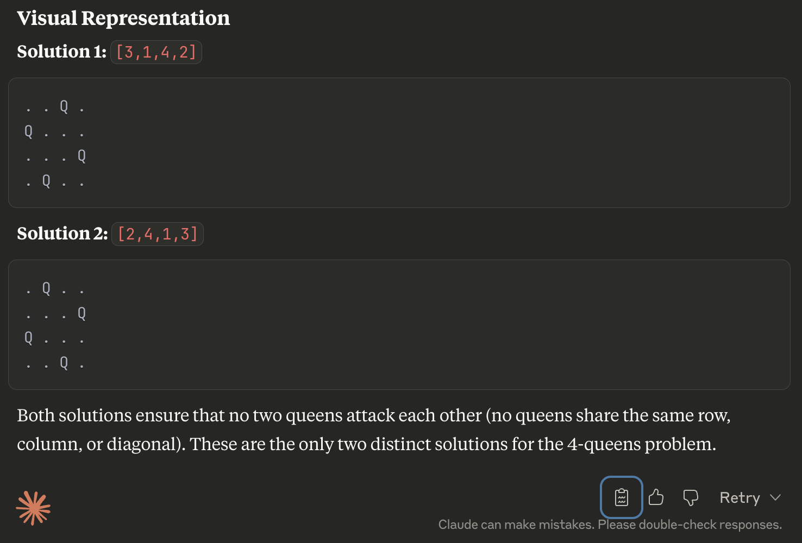

# SWI-Prolog MCP Server

An MCP server that lets tools-enabled LLMs work directly with SWI‑Prolog. It supports loading Prolog files, adding/removing facts and rules, listing symbols, and running queries with two modes: deterministic pagination and true engine backtracking.

## Table of Contents

- [🤖 How Claude Desktop™ Uses swipl-mcp-server to Solve the 4-Queens Problem](#-how-claude-desktop-uses-swipl-mcp-server-to-solve-the-4-queens-problem)
- [Requirements](#requirements)
- [Quick Start](#quick-start)
- [Configuration](#configuration)
- [Tools](#tools)
- [Examples](#examples)
- [Architecture](#architecture)
- [Troubleshooting](#troubleshooting)
- [Development](#development)
- [Contributing](#contributing)
- [License](#license)

## 🤖 How Claude Desktop™ Uses swipl-mcp-server to Solve the 4-Queens Problem

🎯 **Watch Claude go from curious newcomer to chess puzzle master!** ✨ 

These screenshots capture an *exciting* Claude Code session where our AI friend discovers the swipl-mcp-server, gets acquainted with its tools, and then tackles the **legendary 4-queens problem** like a digital detective—*no hints, no help*, just ***pure logical reasoning*** in action! 🚀

<div style="display: flex; flex-direction: column; gap: 10px;">
  
  
  
  
</div>


## Requirements

- Node.js ≥ 18.0.0
- SWI‑Prolog installed and available in PATH

## Quick Start

### Claude Desktop (basic)
```json
{
  "mcpServers": {
    "swipl": {
      "command": "npx",
      "args": ["@vpursuit/swipl-mcp-server"]
    }
  }
}
```

Optional timeouts (development):
```json
{
  "mcpServers": {
    "swipl": {
      "command": "npx",
      "args": ["@vpursuit/swipl-mcp-server"],
      "env": {
        "SWI_MCP_READY_TIMEOUT_MS": "10000",
        "SWI_MCP_QUERY_TIMEOUT_MS": "120000",
        "MCP_LOG_LEVEL": "debug",
        "DEBUG": "swipl-mcp-server"
      }
    }
  }
}
```

### MCP Inspector
```bash
npx @modelcontextprotocol/inspector --transport stdio npx @vpursuit/swipl-mcp-server
```

Configuration file location:
- macOS: `~/Library/Application Support/Claude/claude_desktop_config.json`
- Windows: `%APPDATA%/Claude/claude_desktop_config.json`

## Configuration

### Environment Variables

Configure timeouts, logging, and behavior via environment variables:

- `SWI_MCP_READY_TIMEOUT_MS`: server startup timeout (ms), default 5000
- `SWI_MCP_QUERY_TIMEOUT_MS`: query execution timeout (ms), default 30000
- `MCP_LOG_LEVEL`: `debug` | `info` | `warn` | `error` | `silent` (default `warn`)
- `DEBUG`: enable debug logs, set to `swipl-mcp-server`
- `SWI_MCP_TRACE`: optional low-level trace of child I/O and protocol
- `SWI_MCP_PROLOG_PATH`: override Prolog server script path

## Tools

- Core: `help`, `license`, `capabilities`
- Database: `db_load`, `db_assert`, `db_assert_many`, `db_retract`, `db_retract_many`, `db_retract_all`, `db_dump`
- Query: `query_start`, `query_startEngine`, `query_next`, `query_close`
- Symbols: `symbols_list`

## Examples

- Load and query:
  - `db_load { filename: "family.pl" }`
  - `query_start { query: "parent(X, mary)" }` → `query_next()` until no more solutions → `query_close()`
- Engine mode:
  - `query_startEngine { query: "member(X, [1,2,3])" }` → `query_next()` repeatedly → `query_close()`
- Database operations:
  - Single: `db_assert { fact: "parent(john, mary)" }`
  - Multiple: `db_assert_many { facts: ["parent(john, mary)", "parent(mary, alice)"] }`
  - Remove single: `db_retract { fact: "parent(john, mary)" }`
  - Remove multiple: `db_retract_many { facts: ["parent(john, mary)", "parent(mary, alice)"] }`
  - Clear all: `db_retract_all {}`

See docs/examples.md for many more, including arithmetic, list ops, collections, and string/atom helpers.

## Architecture

- Single persistent SWI‑Prolog process with two query modes (standard via `call_nth/2`, engine via SWI engines)
- Term-based wire protocol: Node wraps requests as `cmd(ID, Term)`, replies as `id(ID, Reply)`; back‑compatible with bare terms
- Hybrid security model with library(sandbox) validation and explicit blacklist; guarded consultation of files

Details: see docs/architecture.md.

## Troubleshooting

- "Prolog not found": ensure `swipl --version` works; SWI‑Prolog must be in PATH
- Startup timeout: increase `SWI_MCP_READY_TIMEOUT_MS`
- Query timeout: increase `SWI_MCP_QUERY_TIMEOUT_MS`
- Session conflicts: close current session before starting a different mode
- `error(unsafe_goal(...))`: your query uses blocked predicates; see Security
- Custom script path: set `SWI_MCP_PROLOG_PATH`
- Query sessions: after exhausting solutions, `query_next` returns "No more solutions available" until explicitly closed

## Development

- Install deps: `npm install`
- Build: `npm run build`
- Run dev server: `npm run server`
- Tests: `npm test` (see CONTRIBUTING.md for details)

Publishing and release workflows are documented in docs/deployment.md.

## Contributing

See CONTRIBUTING.md for local setup, workflow, and the PR checklist.

For security practices, reporting, and hardening guidance, see SECURITY.md.

Further reading:
- [docs/architecture.md](docs/architecture.md) — components, modes, and wire protocol
- [docs/deployment.md](docs/deployment.md) — release, packaging, and install from source
- [docs/examples.md](docs/examples.md) — copy‑paste examples

## License

BSD‑3‑Clause. See LICENSE for details.
